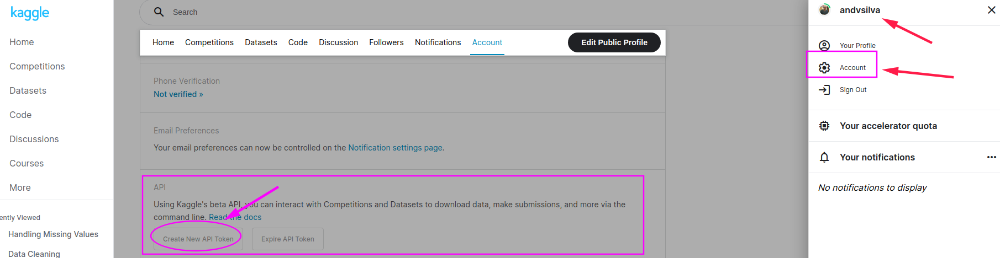

## Data Cleaning

To train our skills in data cleaning, let's go to make an example using the dataset from ```kaggle```

### Download dataset

```bash
# install kaggle API to download
pip install kaggle
```

#### API token



```bash
# download the API token 'kaggle.json'

mkdir ~/.kaggle/
mv ~/.kaggle/kaggle.json

# Done, now we can download from kaggle using API.
```


## Resources

[Kaggle API](https://github.com/Kaggle/kaggle-api#datasets)

[How to Use Kaggle](https://www.kaggle.com/docs/api)

[How to Search and Download Data using Kaggle API?](https://towardsdatascience.com/how-to-search-and-download-data-using-kaggle-api-f815f7b98080)


