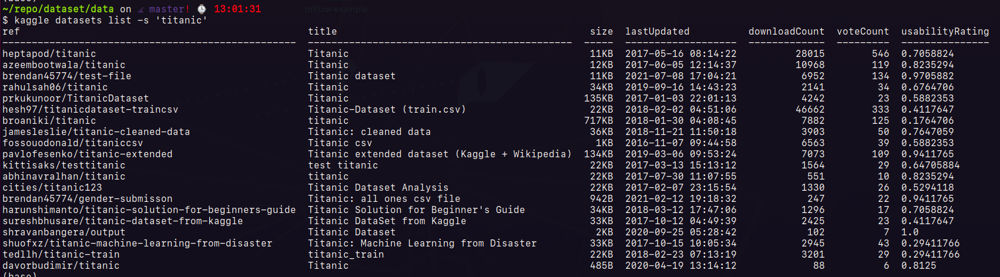

## Data Cleaning

To train our skills in data cleaning, let's go to make an example using the dataset from ```kaggle```

### Download dataset

```bash
# install kaggle API to download
pip install kaggle
```

#### API token


```bash
# download the API token 'kaggle.json'

mkdir ~/.kaggle/
mv ~/.kaggle/kaggle.json

# Done, now we can download from kaggle using API.

# list datasets, e.g. dataset titanic

$ ~/repo/dataset/data
$ kaggle datasets list -s 'titanic'
```



# Hands on

```bash
$ kaggle datasets list -s 'NFL Play by Play 2009-2017'
$ kaggle datasets download -d maxhorowitz/nflplaybyplay2009to2016

$ kaggle datasets download -d maxhorowitz/nflplaybyplay2009to2016
Downloading nflplaybyplay2009to2016.zip to ~/repo/dataset/data
100%|██████████████████████████████████████████████████████████████████████████████████████████████████████████████████████████████████▉| 274M/274M [00:43<00:00, 8.60MB/s]
100%|███████████████████████████████████████████████████████████████████████████████████████████████████████████████████████████████████| 274M/274M [00:43<00:00, 6.57MB/s]
$ ls nflplaybyplay2009to2016.zip
nflplaybyplay2009to2016.zip

# Unzip
$ unzip nflplaybyplay2009to2016.zip 
Archive:  nflplaybyplay2009to2016.zip
  inflating: NFL Play by Play 2009-2016 (v3).csv  
  inflating: NFL Play by Play 2009-2017 (v4).csv  
  inflating: NFL Play by Play 2009-2018 (v5).csv
  ```


## Resources

[Kaggle API](https://github.com/Kaggle/kaggle-api#datasets)

[How to Use Kaggle](https://www.kaggle.com/docs/api)

[How to Search and Download Data using Kaggle API?](https://towardsdatascience.com/how-to-search-and-download-data-using-kaggle-api-f815f7b98080)


