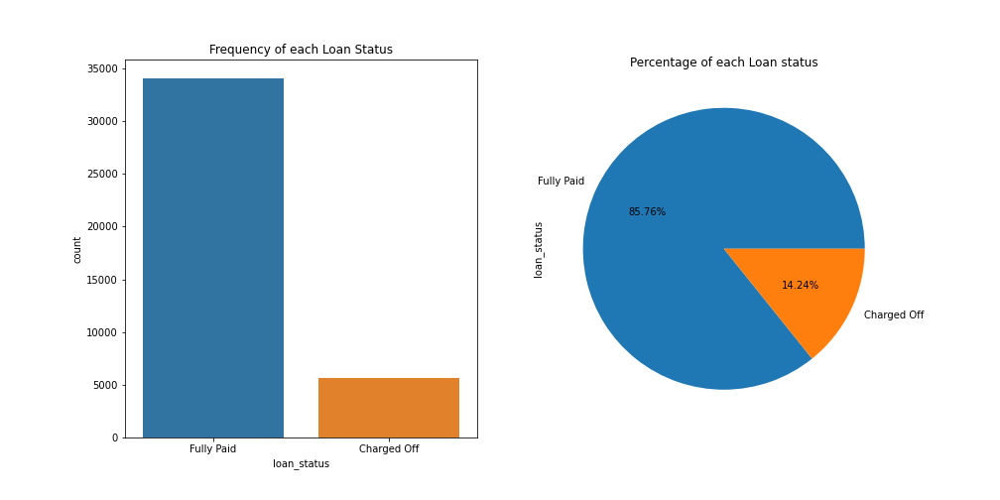

# Data Science - Landscape

Here I will describe in details each step to do a Machine Learning (ML) project. In the Figure below, we will following this roadmap to guide our studies in data science.


## Data Pre-processing

- Data Cleaning
- Handling Missing Data
- Obtaining Data
- Feature Engineering
- Feature Selection
### Hands on data cleaning

First, we will explore the dataset using some techniques to make the data cleaning process.

- ```>>> dataset: data/lending_club_loans.csv```

```bash
>>> OBJETIVE:
Building a model to predict wether borrowers are likely
to pay or default on their loans
```

```bash
$ python
Python 3.7.9 (default, Aug 31 2020, 12:42:55) 
[GCC 7.3.0] :: Anaconda, Inc. on linux
Type "help", "copyright", "credits" or "license" for more information.
>>> import pandas as pd
>>> df = pd.read_csv('../data/lending_club_loans.csv')
>>> df.shape
(39786, 47)
>>> df.info()
<class 'pandas.core.frame.DataFrame'>
RangeIndex: 39786 entries, 0 to 39785
Data columns (total 47 columns):
 #   Column                      Non-Null Count  Dtype  
---  ------                      --------------  -----  
 0   id                          39786 non-null  int64  
 1   member_id                   39786 non-null  int64  
 2   loan_amnt                   39786 non-null  int64  
 3   funded_amnt                 39786 non-null  int64  
 4   funded_amnt_inv             39786 non-null  float64
 5   term                        39786 non-null  object 
 6   int_rate                    39786 non-null  object 
 7   installment                 39786 non-null  float64
 8   grade                       39786 non-null  object 
 9   sub_grade                   39786 non-null  object 
 10  emp_length                  38708 non-null  object 
 11  home_ownership              39786 non-null  object 
 12  annual_inc                  39786 non-null  float64
 13  verification_status         39786 non-null  object 
 14  issue_d                     39786 non-null  object 
 15  loan_status                 39786 non-null  object 
 16  pymnt_plan                  39786 non-null  object 
 17  zip_code                    39786 non-null  object 
 18  addr_state                  39786 non-null  object 
 19  dti                         39786 non-null  float64
 20  delinq_2yrs                 39786 non-null  int64  
 21  earliest_cr_line            39786 non-null  object 
 22  inq_last_6mths              39786 non-null  int64  
 23  open_acc                    39786 non-null  int64  
 24  pub_rec                     39786 non-null  int64  
 25  revol_bal                   39786 non-null  int64  
 26  revol_util                  39736 non-null  object 
 27  total_acc                   39786 non-null  int64  
 28  initial_list_status         39786 non-null  object 
 29  out_prncp                   39786 non-null  float64
 30  out_prncp_inv               39786 non-null  float64
 31  total_pymnt                 39786 non-null  float64
 32  total_pymnt_inv             39786 non-null  float64
 33  total_rec_prncp             39786 non-null  float64
 34  total_rec_int               39786 non-null  float64
 35  total_rec_late_fee          39786 non-null  float64
 36  recoveries                  39786 non-null  float64
 37  collection_recovery_fee     39786 non-null  float64
 38  last_pymnt_d                39715 non-null  object 
 39  last_pymnt_amnt             39786 non-null  float64
 40  last_credit_pull_d          39784 non-null  object 
 41  collections_12_mths_ex_med  39730 non-null  float64
 42  application_type            39786 non-null  object 
 43  chargeoff_within_12_mths    39730 non-null  float64
 44  delinq_amnt                 39786 non-null  int64  
 45  pub_rec_bankruptcies        39089 non-null  float64
 46  tax_liens                   39747 non-null  float64
dtypes: float64(18), int64(11), object(18)
memory usage: 14.3+ MB
>>> df.isna().sum()
id                               0
member_id                        0
loan_amnt                        0
funded_amnt                      0
funded_amnt_inv                  0
term                             0
int_rate                         0
installment                      0
grade                            0
sub_grade                        0
emp_length                    1078
home_ownership                   0
annual_inc                       0
verification_status              0
issue_d                          0
loan_status                      0
pymnt_plan                       0
zip_code                         0
addr_state                       0
dti                              0
delinq_2yrs                      0
earliest_cr_line                 0
inq_last_6mths                   0
open_acc                         0
pub_rec                          0
revol_bal                        0
revol_util                      50
total_acc                        0
initial_list_status              0
out_prncp                        0
out_prncp_inv                    0
total_pymnt                      0
total_pymnt_inv                  0
total_rec_prncp                  0
total_rec_int                    0
total_rec_late_fee               0
recoveries                       0
collection_recovery_fee          0
last_pymnt_d                    71
last_pymnt_amnt                  0
last_credit_pull_d               2
collections_12_mths_ex_med      56
application_type                 0
chargeoff_within_12_mths        56
delinq_amnt                      0
pub_rec_bankruptcies           697
tax_liens                       39
dtype: int64
>>>

# dictionary feature 

# 1 - addr_state: .......The state provided by the borrower in the loan application
# 2 - annual_inc: .......The self-reported annual income provided by the borrower during registration.
# 3 - delinq_2yrs: .......The number of 30+ days past-due incidences of delinquency in the borrower's credit file for the past 2 years
# 4 - dti: .......A ratio calculated using the borrower’s total monthly debt payments on the total debt obligations, excluding mortgage and the requested LC loan, divided by the borrower’s self-reported monthly income.
# 5 - earliest_cr_line: .......The month the borrower's earliest reported credit line was opened
# 6 - emp_length: .......Employment length in years. Possible values are between 0 and 10 where 0 means less than one year and 10 means ten or more years. 
# 7 - grade: .......LC assigned loan grade
# 8 - home_ownership: .......The home ownership status provided by the borrower during registration. Our values are: RENT, OWN, MORTGAGE, OTHER.
# 9 - inq_last_6mths: .......The number of inquiries in past 6 months (excluding auto and mortgage inquiries)
# 10 - installment: .......The monthly payment owed by the borrower if the loan originates.
# 11 - issue_d: .......The month which the loan was funded
# 12 - last_credit_pull_d: .......The most recent month LC pulled credit for this loan
# 13 - last_pymnt_amnt: .......Last total payment amount received
# 14 - loan_amnt: .......The listed amount of the loan applied for by the borrower. If at some point in time, the credit department reduces the loan amount, then it will be reflected in this value.
# 15 - loan_status: .......Current status of the loan
# 16 - open_acc: .......The number of open credit lines in the borrower's credit file.
# 17 - pub_rec: .......Number of derogatory public records
# 18 - pub_rec_bankruptcies: .......Number of public record bankruptcies
# 19 - revol_bal: .......Total credit revolving balance
# 20 - revol_util: .......Revolving line utilization rate, or the amount of credit the borrower is using relative to all available revolving credit.
# 21 - term: .......The number of payments on the loan. Values are in months and can be either 36 or 60.
# 22 - total_acc: .......The total number of credit lines currently in the borrower's credit file
# 23 - verification_status: .......Indicates if income was verified by LC, not verified, or if the income source was verified
```

```bash
TARGET >>> loan_status: .......Current status of the loan

{'Fully Paid': '85.73%',
 'Charged Off': '14.23%',
 'Late (31-120 days)': '0.03%',
 'Current': '0.01%',
 'Late (16-30 days)': '0.00%',
 'In Grace Period': '0.00%',
 'Default': '0.00%'}

To predict which of 'Fully Paid' or 'Charged Off' a loan will fall under, 
so we can treat the problem as binary classification.
```



## Tasks

```bash
@andvsilva
## Done so far 2021-07-20 11h32 
- impute mode (category feature) and mean value to the missing data
- convert object (string) to category
- convert object (number) to float64

# Next thing to do  2021-07-21 17h18 - done
- Check for outliers.
- Using boxplot to look for outlier for each column.

# Sat Jul 24 21:15:40 -03 2021 done
# Working on - Exploring it and understanding what feature 
# each column represents. 
A nice way to show the data is using 'pandas_profiling' 
(see the documentation for more information, link in resources)

# Next explore dataset in more details
## Tue Jul 27 17:11:31 -03 2021  (Work in progress)
- delete features and impute mean and median to missing value

# After analyzing the columns and considering the model we’re 
# trying to build, we can conclude that the following 
# features can be removed:

features2removed = ['id', 'member_id', 'funded_amnt', 'funded_amnt_inv',
                    'sub_grade', 'int_rate', 'zip_code','out_prncp','out_prncp_inv',
                    'total_pymnt','total_pymnt_inv', 'total_rec_prncp','total_rec_int',
                    'total_rec_late_fee','recoveries',
                    'collection_recovery_fee', 'last_pymnt_d']

df = df.drop(features2removed, axis=1)

# drop the column 'issued_d' - leaks data from the future.

Number of rows.....................: 39786
Number of columns..................: 23

- dictionary features - notebook - cleaning already.
# To prepare the dataset feather file format to feature selection
```

- [report-lending_club_loans.html](notebooks/reports/lending_club_loans.html)
### resources

- [A Straightforward Guide to Cleaning and Preparing Data in Python](https://towardsdatascience.com/a-straightforward-guide-to-cleaning-and-preparing-data-in-python-8c82f209ae33)
- [Ways to Detect and Remove the Outliers](https://towardsdatascience.com/ways-to-detect-and-remove-the-outliers-404d16608dba)
- [Detecting And Treating Outliers In Python — Part 1](https://towardsdatascience.com/detecting-and-treating-outliers-in-python-part-1-4ece5098b755)
- [Pandas Profiling](https://pandas-profiling.github.io/pandas-profiling/docs/master/index.html)
