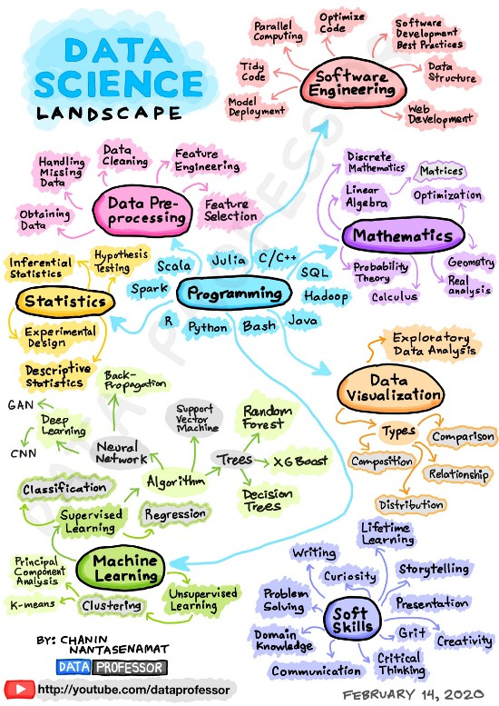

# Data Science - Landscape

Here I will describe in details each step to do a Machine Learning (ML) project. In the Figure below, we will following this roadmap to guide our studies in data science.




## Data Pre-processing

- Data Cleaning
- Handling Missing Data
- Obtaining Data
- Feature Engineering
- Feature Selection

### Hands on data cleaning

First, we will explore the dataset using some techniques to make the data cleaning process.

- ```>>> dataset: data/lending_club_loans.csv```

```bash
$ python
Python 3.7.9 (default, Aug 31 2020, 12:42:55) 
[GCC 7.3.0] :: Anaconda, Inc. on linux
Type "help", "copyright", "credits" or "license" for more information.
>>> import pandas as pd
>>> df = pd.read_csv('../data/lending_club_loans.csv')
>>> df.shape
(39786, 47)
>>> df.info()
<class 'pandas.core.frame.DataFrame'>
RangeIndex: 39786 entries, 0 to 39785
Data columns (total 47 columns):
 #   Column                      Non-Null Count  Dtype  
---  ------                      --------------  -----  
 0   id                          39786 non-null  int64  
 1   member_id                   39786 non-null  int64  
 2   loan_amnt                   39786 non-null  int64  
 3   funded_amnt                 39786 non-null  int64  
 4   funded_amnt_inv             39786 non-null  float64
 5   term                        39786 non-null  object 
 6   int_rate                    39786 non-null  object 
 7   installment                 39786 non-null  float64
 8   grade                       39786 non-null  object 
 9   sub_grade                   39786 non-null  object 
 10  emp_length                  38708 non-null  object 
 11  home_ownership              39786 non-null  object 
 12  annual_inc                  39786 non-null  float64
 13  verification_status         39786 non-null  object 
 14  issue_d                     39786 non-null  object 
 15  loan_status                 39786 non-null  object 
 16  pymnt_plan                  39786 non-null  object 
 17  zip_code                    39786 non-null  object 
 18  addr_state                  39786 non-null  object 
 19  dti                         39786 non-null  float64
 20  delinq_2yrs                 39786 non-null  int64  
 21  earliest_cr_line            39786 non-null  object 
 22  inq_last_6mths              39786 non-null  int64  
 23  open_acc                    39786 non-null  int64  
 24  pub_rec                     39786 non-null  int64  
 25  revol_bal                   39786 non-null  int64  
 26  revol_util                  39736 non-null  object 
 27  total_acc                   39786 non-null  int64  
 28  initial_list_status         39786 non-null  object 
 29  out_prncp                   39786 non-null  float64
 30  out_prncp_inv               39786 non-null  float64
 31  total_pymnt                 39786 non-null  float64
 32  total_pymnt_inv             39786 non-null  float64
 33  total_rec_prncp             39786 non-null  float64
 34  total_rec_int               39786 non-null  float64
 35  total_rec_late_fee          39786 non-null  float64
 36  recoveries                  39786 non-null  float64
 37  collection_recovery_fee     39786 non-null  float64
 38  last_pymnt_d                39715 non-null  object 
 39  last_pymnt_amnt             39786 non-null  float64
 40  last_credit_pull_d          39784 non-null  object 
 41  collections_12_mths_ex_med  39730 non-null  float64
 42  application_type            39786 non-null  object 
 43  chargeoff_within_12_mths    39730 non-null  float64
 44  delinq_amnt                 39786 non-null  int64  
 45  pub_rec_bankruptcies        39089 non-null  float64
 46  tax_liens                   39747 non-null  float64
dtypes: float64(18), int64(11), object(18)
memory usage: 14.3+ MB
>>> df.isna().sum()
id                               0
member_id                        0
loan_amnt                        0
funded_amnt                      0
funded_amnt_inv                  0
term                             0
int_rate                         0
installment                      0
grade                            0
sub_grade                        0
emp_length                    1078
home_ownership                   0
annual_inc                       0
verification_status              0
issue_d                          0
loan_status                      0
pymnt_plan                       0
zip_code                         0
addr_state                       0
dti                              0
delinq_2yrs                      0
earliest_cr_line                 0
inq_last_6mths                   0
open_acc                         0
pub_rec                          0
revol_bal                        0
revol_util                      50
total_acc                        0
initial_list_status              0
out_prncp                        0
out_prncp_inv                    0
total_pymnt                      0
total_pymnt_inv                  0
total_rec_prncp                  0
total_rec_int                    0
total_rec_late_fee               0
recoveries                       0
collection_recovery_fee          0
last_pymnt_d                    71
last_pymnt_amnt                  0
last_credit_pull_d               2
collections_12_mths_ex_med      56
application_type                 0
chargeoff_within_12_mths        56
delinq_amnt                      0
pub_rec_bankruptcies           697
tax_liens                       39
dtype: int64
>>>
```

## Tasks

```bash
## Done so far 2021-07-20 11h32
- impute mode (category feature) and mean value to the missing data
- convert object (string) to category
- convert object (number) to float64

# Next thing to do
- Check for outliers.

# To prepare the dataset feather file format to feature selection
```


### resources

- [A Straightforward Guide to Cleaning and Preparing Data in Python](https://towardsdatascience.com/a-straightforward-guide-to-cleaning-and-preparing-data-in-python-8c82f209ae33)