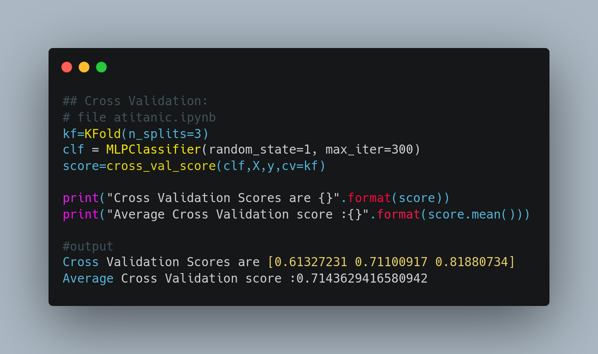

### Observações Prof. Anderson

- [x] Usou train_test_split -> semente = 1 ??? **DONE**

- [x] Pode ter obtido um resultado favorável, mas pode ter sido superestimado ou subestimado.
Como tirar esta dúvida? Através do crossvalidation.

Então a partir dali deve fazer o crossvalidation.

É preciso implementar o deep learning no jetson nano, mas antes de ir ao equipamento é preciso fazer na plataforma comum.

Proposta de duas coisas: 
    - Implementação de deep learning com o Keras ou com o Tensorflow.
    -  Terá que preparar o ambiente, utilizando o Anaconda

Fazer uma comparação do deep learning (Keras) com a MLP.

**Observações**:
- Fazer com uma base de dados mais robusta: Bank Marketing Dataset
- Rodar o crossvalidation para a rede do sklearn, ou seja, rodar 10 vezes para cada execução;
  - Encontrar o valor de F1Score, etc.
    - Melhor fazer com F1score, pois a acurácia não é muito boa (tem um problema com falso negativo e falso positivo);
- Rodar o crossvalidation (CV) com 10 execuções para rede do sklearn a mesma MLPClassifier;
- Fazer o crossvalidation(CV) para rede do Keras;
  - Verificação estatística dos resultados
    -  Teste de Wilcoxon (aulas 6a e 6b) (tirar dúvida com o Mauro)

Sites explicativos

- [Cross Validation](https://medium.com/@jvsavietto6/machine-learning-m%C3%A9tricas-valida%C3%A7%C3%A3o-cruzada-bias-e-vari%C3%A2ncia-380513d97c95)
  - [validacao-cruzada](https://dataml.com.br/validacao-cruzada-aninhada-com-scikit-learn/)
- [Performance](http://computacaointeligente.com.br/conceitos/avaliando-performance-cross-validation/
)
- [Metrics](https://www.flai.com.br/juscudilio/como-calcular-as-metricas-de-validacao-dos-modelos-de-machine-learning-em-python/)
- [intro-sklearn-part-3](http://computacaointeligente.com.br/outros/intro-sklearn-part-3/)

- [avaliacao-de-performance](https://lapix.ufsc.br/ensino/reconhecimento-de-padroes/avaliando-validando-e-testando-o-seu-modelo-metodologias-de-avaliacao-de-performance/)

[Monografia](https://www.lume.ufrgs.br/bitstream/handle/10183/219122/001123609.pdf?sequence=1)
